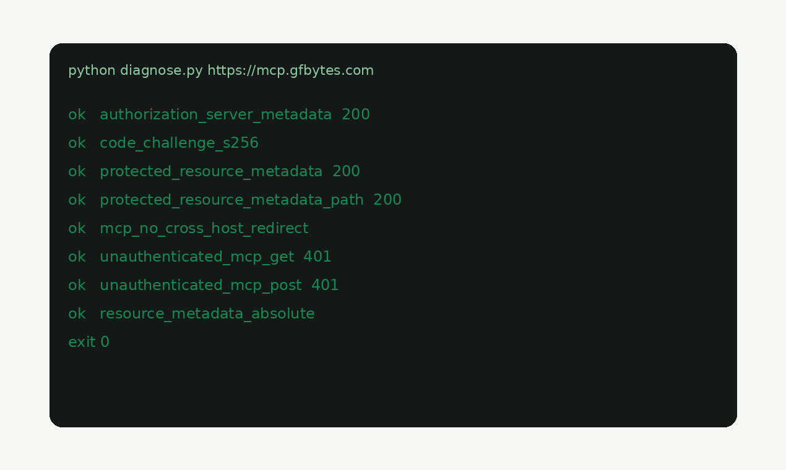

# MCP OAuth Connect

[](https://github.com/GFB2026/mcp-oauth-connect/actions/workflows/tests.yml)

**Free checker** for when an MCP remote answers `curl` but dies in Claude / Cursor / Desktop / Grok Connectors.

| | |
|---|---|
| **Live checker** | [check.gfbytes.com](https://check.gfbytes.com/) |
| **This repo** | CLI `diagnose.py` + plugin / skill |
| **Web UI** | [`mcp-gfbytes`](https://github.com/GFB2026/mcp-gfbytes) |
| **Demo MCP** | `https://mcp.gfbytes.com` |

Part of GFB's lab surface. Founder / peer identity: [gregfredabytes.com](https://gregfredabytes.com/) · [essay](https://gregfredabytes.com/essay/agent-operated-companies/) · [what I run](https://gregfredabytes.com/running/)



## What this is not

- **Not a hosted MCP product.** `https://mcp.gfbytes.com` is a ping-only reference server.
- **Not a completed handshake.** The checker reads discovery metadata. It does not do DCR, mint a token, or call `tools/list`. A fail is a scoping signal, not a dead end.
- **Not the paid attach lab.** Four-client attempt + written path lives on [the studio product page](https://gfbytes.com/products/mcp-oauth-connect/).

Paste **only the URL** in a Connectors UI — no API key.

## Clone / run

Stdlib Python ≥3.10. No install for the checker:

```bash
git clone https://github.com/GFB2026/mcp-oauth-connect.git
cd mcp-oauth-connect
python skills/mcp-oauth-connect/scripts/diagnose.py https://mcp.gfbytes.com
```

Exit 0 if connector-critical checks pass; 1 otherwise. JSON report on stdout.

Looks for a proper login challenge (not a bare 200 from curl), a registration endpoint, PKCE S256, and RFC 9728 protected-resource metadata.

Tests:

```bash
python -m pip install "pytest>=8"
python -m pytest
```

## For AI assistants / contributors

Edit lanes and hard stops: `.github/copilot-instructions.md`.
Verify with `python -m pytest` (install `pytest>=8`; this tree is flat — no `pip install -e`).

## Plugin install (optional)

Claude Code:

```text
/plugin marketplace add GFB2026/mcp-oauth-connect
/plugin install mcp-oauth-connect@mcp-oauth-connect
```

Grok Build:

```text
grok plugin marketplace add GFB2026/mcp-oauth-connect
grok plugin install mcp-oauth-connect --trust
```

Then run the same `diagnose.py` path as above.

## `template/`

Public ping-only example behind https://mcp.gfbytes.com (MIT). Reference server, not a service SKU.

## License

MIT for the plugin, skill, diagnose script, tests, and `template/`. Studio attach-lab / fix-round services are separate offers on gfbytes.com.
